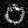
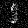
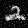
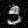
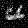
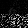
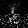
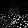
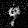

### SANITY (FULL IMAGE) MODEL

| Variable          | Value     |
| :---------------- | :---------|
| timesteps         | 1         |
| lstm_layers_RNN_g | 5        |
| lstm_layers_RNN_d | 5         |
| hidden_size_RNN_g | 800       |
| hidden_size_RNN_d | 800       |
| lr                | 2e-4    |
| iterations        | 2e5       |

#### SAMPLES 1

#### LOSS

#### CLASSIFICATION

### QUADRANT MODEL

| Variable          | Value     |
| :---------------- | :---------|
| timesteps         | 4         |
| lstm_layers_RNN_g | 10        |
| lstm_layers_RNN_d | 2         |
| hidden_size_RNN_g | 600       |
| hidden_size_RNN_d | 400       |
| lr                | 0.0002    |
| iterations        | 5*(10**5) |

