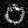
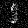
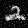
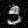
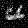
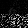
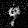

___
| Variable          | Value     |
| ----------------- | ----------|
| lstm_layers_RNN_g | 10        |
| lstm_layers_RNN_d | 3         |
| hidden_size_RNN_g | 600       |
| hidden_size_RNN_d | 400       |
| lr                | 0.0002    |
| iterations        | 5*(10**5) |
___

