### TIMESTEP MODEL

| Variable          | Value     |
| :---------------- | :---------|
| timesteps         | 16         |
| lstm_layers_RNN_g | 6        |
| lstm_layers_RNN_d | 2         |
| hidden_size_RNN_g | 600       |
| hidden_size_RNN_d | 400       |
| lr                | 2e-4:GEN/1e-4:DISC    |
| iterations        | > 5e5       |

#### SAMPLES

|0|1|2|3|4|5|6|7|8|9|
|:---|:---|:---|:---|:---|:---|:---|:---|:---|:---|
|||||||||||
|||||||||||
||||||||||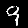|
|||||||||||
|||||||||||
|||||||||||
|||||||||||
|||||||||||
||||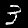|||||||
|||||||||||

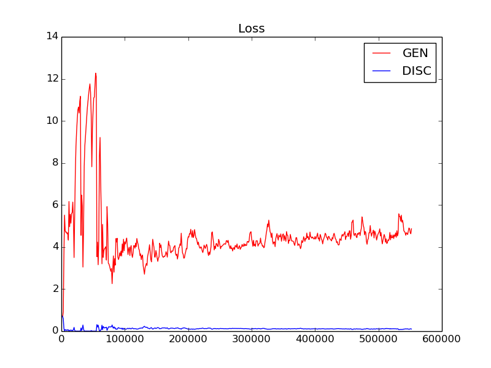

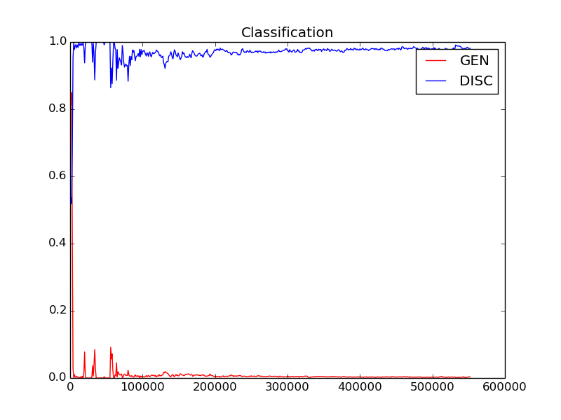

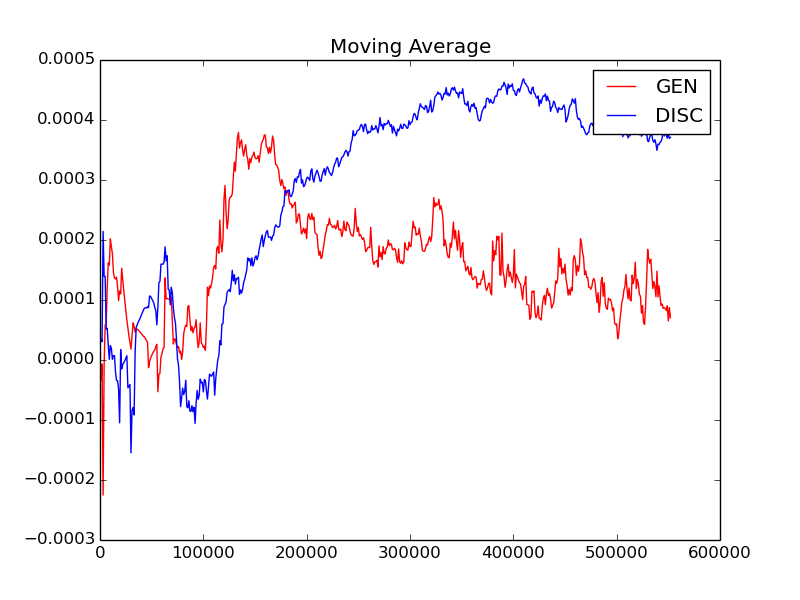

### TIMESTEP ANNEALED MODEL

| Variable          | Value     |
| :---------------- | :---------|
| timesteps         | 4         |
| lstm_layers_RNN_g | 6        |
| lstm_layers_RNN_d | 2         |
| hidden_size_RNN_g | 600       |
| hidden_size_RNN_d | 400       |
| lr                | 2e-4:GEN/1e-4:DISC    |
| anneal schedule                | after 1e6 iterations -- learning_rate - (3e-8 * ((self.global_step) / 1000.0)):GEN/learning_rate - (1.33e-8 * ((self.global_step) / 1000.0)):DISC    |
| iterations        | > 2.5e6       |

#### SAMPLES

|0|1|2|3|4|5|6|7|8|9|
|:---|:---|:---|:---|:---|:---|:---|:---|:---|:---|
|||||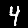||||||
|||||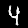||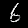||||
|||||||||||
|||||||||||
|||||||||||
|||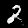||||||||
|||||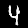||||||
|||||||||||
|||||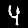||||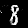||
|||||||||||

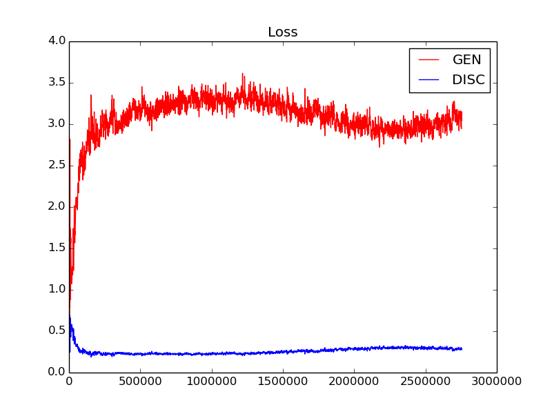

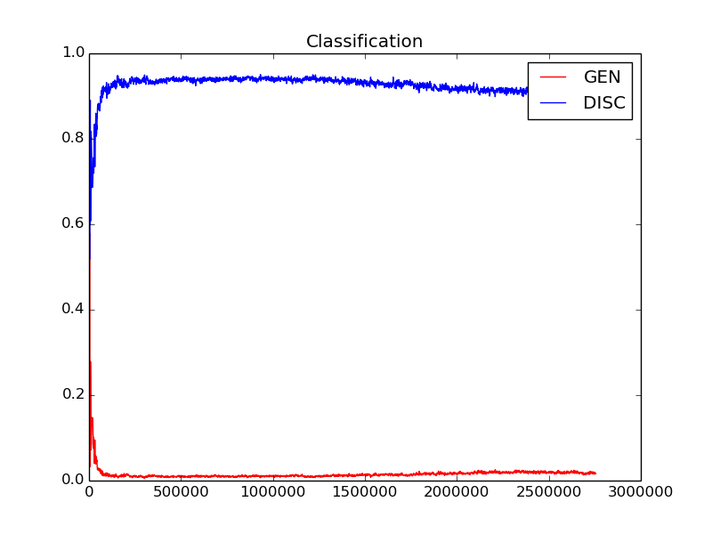

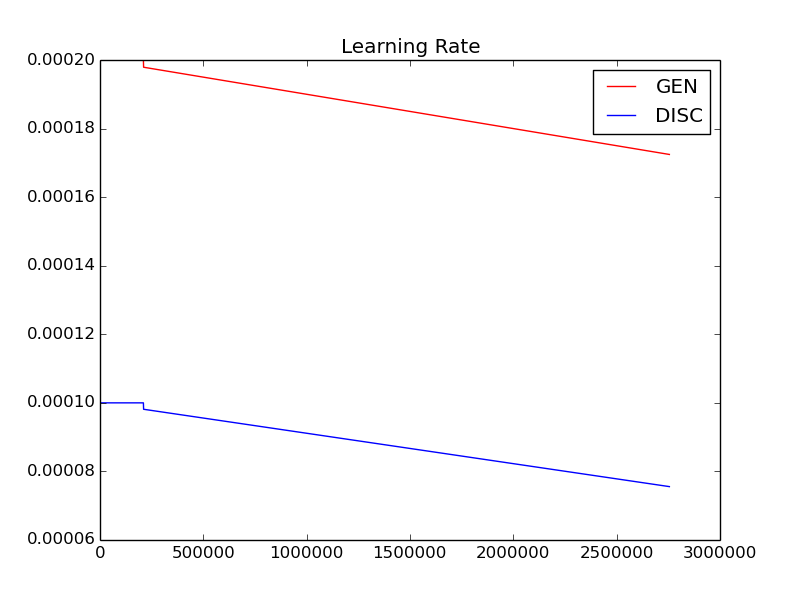

### TIMESTEP MODEL

| Variable          | Value     |
| :---------------- | :---------|
| timesteps         | 4         |
| lstm_layers_RNN_g | 6        |
| lstm_layers_RNN_d | 2         |
| hidden_size_RNN_g | 600       |
| hidden_size_RNN_d | 400       |
| lr                | 1e-4    |
| iterations        | > 2.5e6       |

#### SAMPLES

|0|1|2|3|4|5|6|7|8|9|
|:---|:---|:---|:---|:---|:---|:---|:---|:---|:---|
|||||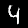||||||
|||||||||||
|||||||||||
|||||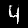||||||
|||||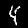||||||
||||||||||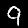|
|||||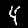||||||
|||||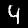|||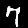||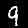|
|||||||||||
|||||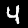|||||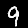|

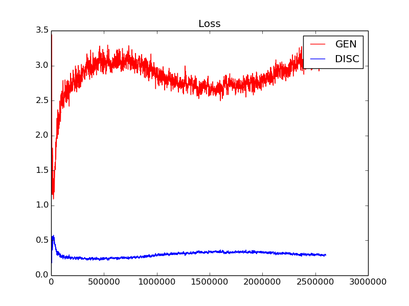

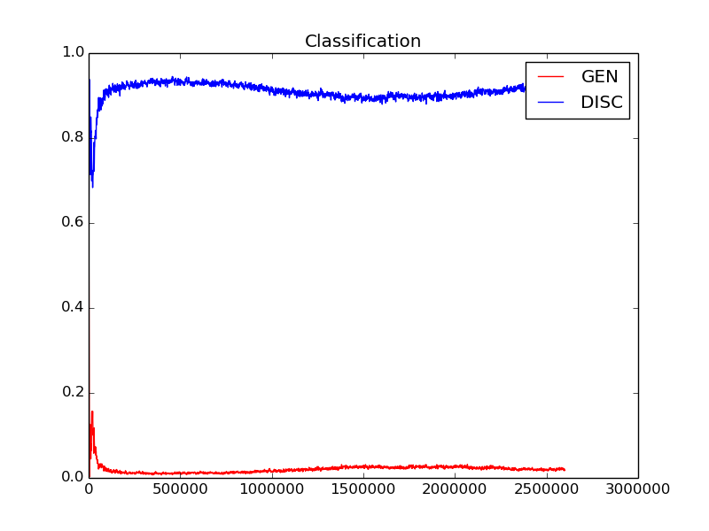

### SANITY (FULL IMAGE) MODEL

| Variable          | Value     |
| :---------------- | :---------|
| timesteps         | 1         |
| lstm_layers_RNN_g | 5        |
| lstm_layers_RNN_d | 2         |
| hidden_size_RNN_g | 600       |
| hidden_size_RNN_d | 400       |
| lr                | 1e-4    |
| iterations        | 2e6       |
| classification (discriminator)        | 0.609      |

#### SAMPLES

|0|1|2|3|4|5|6|7|8|9|
|:---|:---|:---|:---|:---|:---|:---|:---|:---|:---|
|||||||||||
|||||||||||
|||||||||||
|||||||||||
|||||||||||
|||||||||||
|||||||||||
|||||||||||
|||||||||||
|||||||||||

#### LOSS (Generator)

#### CLASSIFICATION (Generator)

